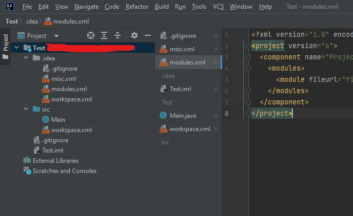

## TabOrganizer plugin

[This YouTrack](https://youtrack.jetbrains.com/issue/IJPL-59208) feature request has been opened since 2007 and unfortunately its never been implemented.

As a former VS user I got used to having the tabs in vertical split (left panel) and grouped by project. Since Rider does not provide this functionality,
this feature allows you to do that.

### Examples

### Installation
The plugin works right of the box, no need to set up anything.

### TODO
These are features I would like to add in future
- BUG: Fix bug when opening two files with a same name
- BUG: Render the group name above the files instead of below
- FEATURE: User can define configuration of the grouping
- REFACTOR: Optimize redrawing the tabs

### Code Documentation & Contribution
In case someone wants to contribute, I am more than happy to review your PR and merge it. See code documentation below.

#### Code
The `TabOrganizerManager` is the main class, which hooks to fileOpened and fileClosed events. Using `TabFileGroup` and `TabFile` classes
it rebuilds the structure of IntelliJ `VirtualFile`s (files that are opened for edit) and IntelliJ `TabInfo` (component that is displayed in the tabs overview).
The `TabFile` is a class that holds the file together with tab in one object instance, and `TabFileGroup` is a parent which holds multiple `TabFile`s, therefore grouping them.

Example:
- Core Folder/Project (TabFileGroup)
  - data.json (TabFile)
  - DataRepository.cs (TabFile)
- API Folder/Project (TabFileGroup)
  - DataController.cs (TabFile)

#### Debugging

For starting IDE with installed plugin for debugging run
- `./gradlew build`
- `./gradlew runIde`

For logging I am using `com. intellij. openapi. diagnostic` `Logger` class. Using the `error` method will output the error into IDE error log
(visible in bottom right corner). There must be way how to debug better (logging just info, or hooking a debugger, feel free to let me know).